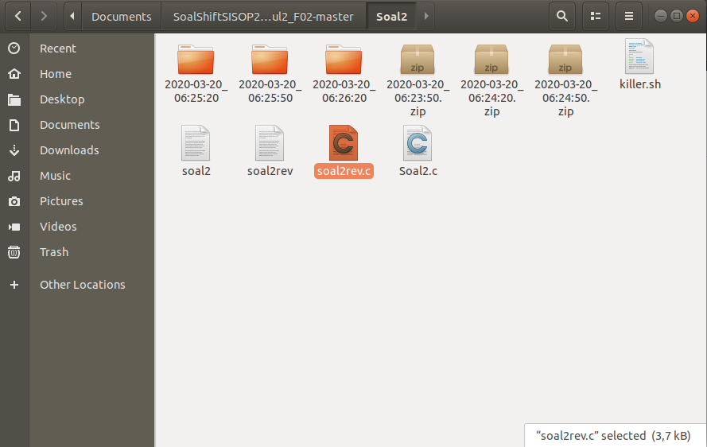
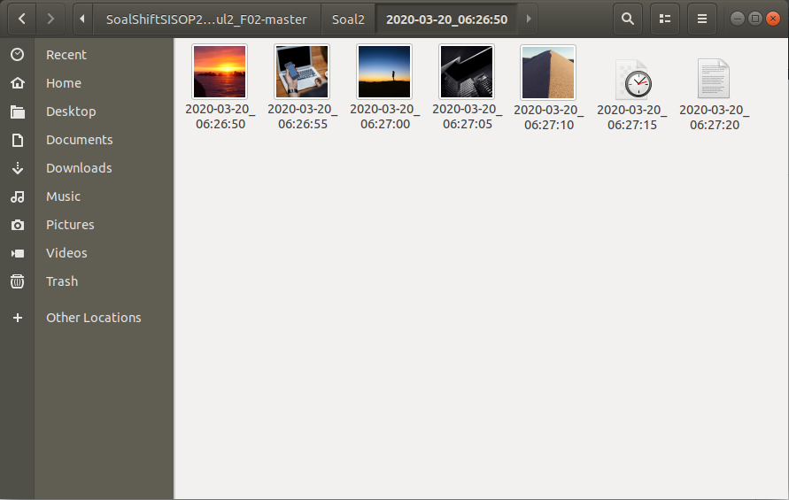
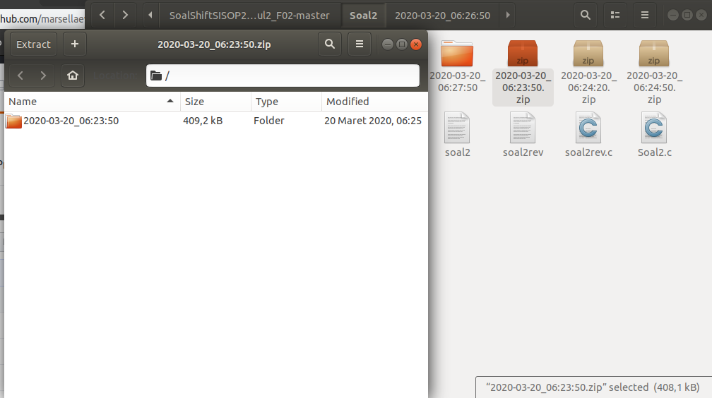
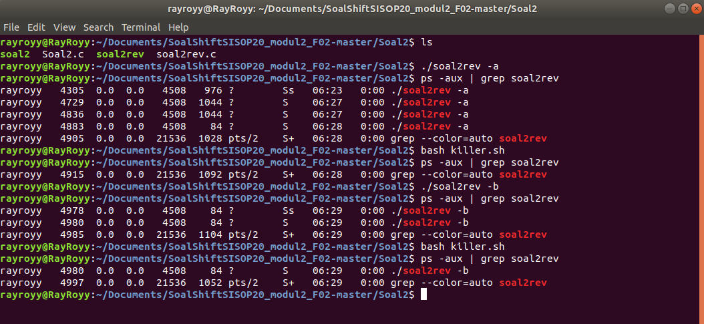

# SoalShiftSISOP20_modul2_F02
Praktikum Modul 2 Sisop 2020

Kelompok F02 (0099 &amp; 0142)

# Pembahasan Jawaban

## No 1 Program C untuk Crontab

### Source Code : [1](https://github.com/marsellaeve/SoalShiftSISOP20_modul2_F02/tree/master/soal1)

```C
#include <sys/types.h>
#include <sys/stat.h>
#include <stdio.h>
#include <stdlib.h>
#include <fcntl.h>
#include <errno.h>
#include <unistd.h>
#include <syslog.h>
#include <string.h>
#include <time.h>
#include <wait.h>
#include<dirent.h>
#include <string.h>
 
int main(int argc, char** array){
  pid_t pid, sid;        // Variabel untuk menyimpan PID

  pid = fork();     // Menyimpan PID dari Child Process

  /* Keluar saat fork gagal
  * (nilai variabel pid < 0) */
  if (pid < 0) {
    exit(EXIT_FAILURE);
  }

  /* Keluar saat fork berhasil
  * (nilai variabel pid adalah PID dari child process) */
  if (pid > 0) {
    exit(EXIT_SUCCESS);
  }

  umask(0);

  sid = setsid();
  if (sid < 0) {
    exit(EXIT_FAILURE);
  }

  if ((chdir("/home/evelyn/Praktikum2")) < 0) {
    exit(EXIT_FAILURE);
  }

  close(STDIN_FILENO);
  close(STDOUT_FILENO);
  close(STDERR_FILENO);


   	time_t rawtime;
	struct tm *timeinfo;
	int i,arr[10],j,temp,a,b;
	char str[35];
	for(i=1;i<argc;i++){ printf("%s",array[i]);}
	DIR *dir;
	struct dirent *ent;
	char text[200]="/home/evelyn/Praktikum2/";
	int flags=0;
	if ((dir = opendir (text)) != NULL) {
	  while ((ent = readdir (dir)) != NULL) {
		if(strcmp(ent->d_name,array[4])==0){flags=1; break;}
	  }
	if(flags==0){
		printf("file tidak ditemukan\n");
		return 0;
	}		
	} 
	if(argc<5||argc>5){
		printf("a Program error masukkan argumen\n");
		return 0;
	}
	if(array[4][(strlen(array[4])-3)]!='.'|| array[4][(strlen(array[4])-2)]!='s'|| array[4][(strlen(array[4])-1)]!='h'){
		printf("Program error masukkan argumen\n");
		return 0;
	}
	int flagss=0;
	for (i = 1; i < argc; ++i){		
		if(strcmp(array[i],"*")==0) {
			flagss++; if(flagss==3) return 0;
			arr[i-1]=-1; continue;}
		else if(i==4){
			strcpy(str,array[i]);
			continue;
		}
		else if(strlen(array[i])>=2){
			a=(int)(array[i][0]);
			b=(int)(array[i][1]);//printf("%d %d\n",a,b);
			a=a-48; b=b-48;  //printf("%d %d\n",a,b);
			if(a<0||a>9||b<0||a>9){
			printf("Program error, input harus angka\n");
			return 0;
			}
			temp=(a*10)+b;
		}
		else if(strlen(array[i])==1){
			temp=(int)(array[i][0])-48;
			if(temp<0||temp>9){
			printf("Program error, b input harus angka\n");
			return 0;
			}
		}
		arr[i-1]=temp;
		//printf("\n%d\n",arr[i-1]);
		
		if((i==1||i==2)&&(arr[i-1]<0||arr[i-1]>59)){
		printf("Program error masukkan detik/menit(0-59)\n");
		return 0;
		}
		
		else if(i==3&&(arr[i-1]>23||arr[i-1]<0)){
		printf("c Program error masukkan jam (0-23)\n");
		return 0;
		}
	}
	
	while(1){
	time(&rawtime);
	timeinfo = localtime(&rawtime);
printf("%d:%d:%d skrg: %d:%d:%d\n",timeinfo->tm_hour,timeinfo->tm_min,timeinfo->tm_sec,arr[2],arr[1],arr[0]);

 pid_t child_id;
  int status;
  child_id = fork();
  if (child_id < 0) {
    exit(EXIT_FAILURE); // Jika gagal membuat proses baru, program akan berhenti
	
  }

  if (child_id == 0) {
    // this is child
	if((timeinfo->tm_sec==arr[0] || arr[0]==-1) && (timeinfo->tm_min==arr[1] || arr[1]==-1) && (timeinfo->tm_hour==arr[2]|| arr[2]==-1)){
printf("masuk %d:%d:%d skrg: %d:%d:%d\n",timeinfo->tm_hour,timeinfo->tm_min,timeinfo->tm_sec,arr[2],arr[1],arr[0]);
		
		char *argv[] = {"bash",array[4], NULL};
		execv("/bin/bash", argv);
	}
	else {printf("blm msk"); exit(0);}
	
  } else {
    // this is parent
    while ((wait(&status)) > 0);
	sleep(1);
  }	
	
  }
}
```

Untuk melihat hasil screenshot, klik url dibawah ini:

[Hasil](https://github.com/marsellaeve/SoalShiftSISOP20_modul2_F02/blob/master/Screenshot%20Praktikum2/Screenshot%20from%202020-03-17%2022-12-43.png)

[B. Error](https://github.com/marsellaeve/SoalShiftSISOP20_modul2_F02/blob/master/Screenshot%20Praktikum2/Screenshot%20from%202020-03-17%2022-16-02.png)

#### A. Program menerima 4 argumen detik, menit, jam dan path file bash

`int main(int argc, char** array)` untuk memasukkan inputan dengan argumen (contoh ./program \* 34 7 /home/somi/test.sh saat menjalankan program sekaligus input argumen. Kemudian argc untuk menghitung berapa banyak string nya, dan array of strings disimpan dalam char** array.

`if(strcmp(array[i],"*")==0) { arr[i-1]=-1; continue;}` artinya pada saat inputan * akan dilewati dan diberi nilai -1

`else if(i==4){	strcpy(str,array[i]);	continue;` artinya saat nama file yang sudah disimpan, dicopy ke variable string

`else if(strlen(array[i])>=2){a=(int)(array[i][0]);	b=(int)(array[i][1]);	a=a-48; b=b-48;	temp=(a*10)+b;}` artinya apabila inputan waktu (detik,menit,jam) selain tanda * dilihat jika panjang stringnya 2 maka puluhan, dari string diubah menjadi bilangan char kemudian dikurangi 48 karena angka 0 = ascii 48. Kemudian puluhannya dikali 10, agar menjadi bilangan puluhan.

`else if(strlen(array[i])==1){` artinya apabila dia hanya satu string, maka tidak perlu dikali 10.

 `arr[i-1]=temp;` semua angka waktu yang sudah diubah menjadi integer dimasukkan kedalam array.
 
 #### B. Program akan mengeluarkan pesan error jika argumen yang diberikan tidak sesuai
 
 `if ((dir = opendir (text)) != NULL) {
	  while ((ent = readdir (dir)) != NULL) {
		if(strcmp(ent->d_name,array[4])==0){flags=1; break;}`untuk mengecek apakah nama file tersebut ada dalam directory

`if(argc<5||argc>5)` Error apabila argumen yang dimasukkan kurang dari argumen yang seharusnya.
 
 `if(array[4][(strlen(array[4])-3)]!='.'|| array[4][(strlen(array[4])-2)]!='s'|| array[4][(strlen(array[4])-1)]!='h'` error apabila file bukan berekstensi .sh
 
 `if(a<0||a>9||b<0||a>9)` error apabila input detik,menit atau jam bukan berisi angka, sehingga ascii-48 hasilnya bukan angka 0-9.
 
 `if((i==1||i==2)&&(arr[i-1]<0||arr[i-1]>59))` error apabila input detik atau menit selain angka 0-59.
 
 `else if(i==3&&(arr[i-1]>23||arr[i-1]<0))` error apabila input jam selain 0-23.
 
 Revisi: Bagian cek file ada atau tidak dalam directory dan break pada setiap error diganti dengan return 0;
 
 #### C. Program hanya menerima 1 config cron
 
 `if((timeinfo->tm_sec==arr[0] || arr[0]==-1) && (timeinfo->tm_min==arr[1] || arr[1]==-1) && (timeinfo->tm_hour==arr[2]|| arr[2]==-1))` hanya memproses 1 config cron sesuai urutan argumen yang telah diinput.
 
 #### D. Program berjalan di background (daemon)
 
 ```
 pid_t pid, sid;        // Variabel untuk menyimpan PID

  pid = fork();     // Menyimpan PID dari Child Process

  /* Keluar saat fork gagal
  * (nilai variabel pid < 0) */
  if (pid < 0) {
    exit(EXIT_FAILURE);
  }

  /* Keluar saat fork berhasil
  * (nilai variabel pid adalah PID dari child process) */
  if (pid > 0) {
    exit(EXIT_SUCCESS);
  }

  umask(0);

  sid = setsid();
  if (sid < 0) {
    exit(EXIT_FAILURE);
  }

  if ((chdir("/home/evelyn/Praktikum2")) < 0) {
    exit(EXIT_FAILURE);
  }

  close(STDIN_FILENO);
  close(STDOUT_FILENO);
  close(STDERR_FILENO);
```
Menggunakan Daemon dengan template sesuai modul

#### C. Tidak boleh menggunakan fungsi system()

Tidak menggunakan fungsi system() pada codingan, hanya menggunakan daemon, fork, exec, dan lain-lain yang diperbolehkan.

## No 2 Program C untuk Daemon

### Source Code : [2](https://github.com/marsellaeve/SoalShiftSISOP20_modul2_F02/tree/master/Soal2)
```
#include <sys/types.h>
#include <sys/stat.h>
#include <stdio.h>
#include <stdlib.h>
#include <fcntl.h>
#include <errno.h>
#include <unistd.h>
#include <syslog.h>
#include <string.h>
#include <wait.h>
#include <time.h>

// void getTimestamp(char *path);
void writeKillA();
void writeKillB();

int main(int argc, char **argb){
  if(strcmp(argb[1], "-a") == 0){
    writeKillA();
  }
  if(strcmp(argb[1], "-b") == 0){
    writeKillB();
  }

  char buf[100];
  char *workingDir = getcwd(buf, 100);

  pid_t pid, sid;

  pid = fork();
  
  if (pid < 0) {
    exit(EXIT_FAILURE);
  }

  if (pid > 0) {
    exit(EXIT_SUCCESS);
  }

  umask(0);

  sid = setsid();
  if (sid < 0) {
    exit(EXIT_FAILURE);
  }

  if ((chdir("/home/rayroyy/Documents/SoalShiftSISOP20_modul2_F02-master/Soal2")) < 0) {
    exit(EXIT_FAILURE);
  }

  close(STDIN_FILENO);
  close(STDOUT_FILENO);
  close(STDERR_FILENO);

  while(1){
    chdir(workingDir);
    pid_t child_id1;
    int status1;
    
    child_id1 = fork();

    time_t waktufile;
    struct tm *lt;
    time(&waktufile);
    lt = localtime(&waktufile);
    char date[26], namafile[100];
    strftime(namafile, 100, "%Y-%m-%d_%H:%M:%S", lt);
    
    if(child_id1 == 0){
      pid_t child_id2;
      int status2;
      
      child_id2 = fork();

      if(child_id2 == 0){
        char *argv[] = {"mkdir", namafile, NULL};
        execv("/bin/mkdir", argv);
      } else {
        while((wait(&status2)) > 0);
        pid_t child_id3;
        int status3, i;
        char curFolder[1000]; strcpy(curFolder, namafile);
        char link[100];
        char namagambar[100];
        chdir(namafile);

        for(i=0; i<20; i++){
          strcpy(namafile, curFolder); strcat(namafile, "/");
          time_t waktugambar;
          time(&waktugambar);
          struct tm* lt2 = localtime(&waktugambar);
          strftime(namagambar, 100, "%Y-%m-%d_%H:%M:%S", lt2);
          long int sec = time(NULL)%1000 + 100;
          snprintf(link, 1000, "https://picsum.photos/%ld", sec);
          child_id3 = fork();
          if(child_id3 == 0){
            char *argv[] = {"wget", "-O", namagambar, link, NULL};
            execv("/usr/bin/wget", argv);
          }
          sleep(5);
        }

        pid_t child_id4;
        int status4;
        child_id4 = fork();
        while(wait(&status4) > 0);
        chdir("..");
        char outputZip[1000];
        snprintf(outputZip, 1000, "%s.zip", curFolder);

        pid_t child_id5= fork();
        if(child_id5 == 0){
          char *argv[] = {"zip", "-r", outputZip, curFolder, NULL};
          execv("/usr/bin/zip", argv);
        }
        int status5;
        while(wait(&status5) > 0);
        char *argv[] = {"rm", "-rf", curFolder, NULL};
        execv("/bin/rm", argv);
      }
    }
    sleep(30);
  }
  return 0;
}

void writeKillA()
{
  FILE *temp;
  temp = fopen("killer.sh", "w");
  fputs("#!/bin/bash\n", temp);
  fputs("killOrder=$(echo $(pidof soal2rev))\n", temp);
  fputs("kill -9 $killOrder\n", temp);
  fputs("rm $0\n", temp);
  fclose(temp);

  pid_t tempChild_id;
  int tempStatus;
  tempChild_id = fork();

  if(tempChild_id == 0){
    char *argv[]={"chmod", "+x", "killer.sh", NULL};
    execv("/bin/chmod", argv);
  }
}

void writeKillB()
{
  FILE *temp;
  temp = fopen("killer.sh", "w");
  fputs("#!/bin/bash\n", temp);
  fputs("killOrder=$(echo $(pidof soal2rev))\n", temp);
  fputs("killOrder=${killOrder##* }\n", temp);
  fputs("kill -9 $killOrder\n", temp);
  fputs("rm $0\n", temp);
  fclose(temp);

  pid_t tempChild_id;
  int tempStatus;
  tempChild_id = fork();

  if(tempChild_id == 0){
    char *argv[]={"chmod", "+x", "killer.sh", NULL};
    execv("/bin/chmod", argv);
  }
}

```

Berikut adalah hasil screenshot dari program :

### 1. Membuat file tiap 30 detik dengan format nama file menggunakan timestamp yang telah ditentukan oleh soal serta melakukan zip pada file yang telah terisi oleh 20 gambar :


### 2. Mendownload file tiap 5 detik dengan format nama gambar menggunakan timestamp yang telah ditentukan oleh soal :


### 3. Isi dari dari zip :


### 4. Menjalankan kedua mode (a & b) :


#### A. Membuat File tiap 30 detik dengan format timestamp [YYYY-mm-dd_HH:ii:ss].
```
strftime(namafile, 100, "%Y-%m-%d_%H:%M:%S", lt);
char *argv[] = {"mkdir", namafile, NULL};
execv("/bin/mkdir", argv);
```
Pertama-tama membuat variabel namafile yang berisi timestamp, dan membuat folder dengan command mkdir -p dengan nama file yang telah dibuat, lalu di sleep selama 30 detik.

#### B. Tiap-tiap folder lalu diisi dengan 20 gambar yang di download darihttps://picsum.photos/, dimana tiap gambar di download setiap 5 detik. Tiap gambar berbentuk persegi dengan ukuran (t%1000)+100 piksel dimana t adalah detik Epoch Unix. Gambar tersebut diberi nama dengan format timestamp [YYYY-mm-dd_HH:ii:ss].

```
for(i=0; i<20; i++){
          strcpy(namafile, curFolder); strcat(namafile, "/");
          time_t waktugambar;
          time(&waktugambar);
          struct tm* lt2 = localtime(&waktugambar);
          strftime(namagambar, 100, "%Y-%m-%d_%H:%M:%S", lt2);
          long int sec = time(NULL)%1000 + 100;
          snprintf(link, 1000, "https://picsum.photos/%ld", sec);
          child_id3 = fork();
          if(child_id3 == 0){
            char *argv[] = {"wget", "-O", namagambar, link, NULL};
            execv("/usr/bin/wget", argv);
          }
          sleep(5);
        }
```
Pada web picsum terdapat sebuah link dimana kita dapat mengatur ukuran foto yang kita download, oleh karena itu dibuat sebuah variabel long integer yang menghitung rumus yang dimuat didalam soal, lalu baru dipanggil fungsi wget dan nama gambar tersebut diambil dari variabel date2. Dilakukan looping sebanyak 20 kali dengan interval 5 detik menggunakan `sleep(5)`.

### C. Setelah Folder terisi oleh 20 gambar, Folder akan di zip, dan folder asli akan dihapus dan menyisakan hanya folder zip
```
snprintf(outputZip, 1000, "%s.zip", curFolder);

        pid_t child_id5= fork();
        if(child_id5 == 0){
          char *argv[] = {"zip", "-r", outputZip, curFolder, NULL};
          execv("/usr/bin/zip", argv);
        }
        int status5;
        while(wait(&status5) > 0);
        char *argv[] = {"rm", "-rf", curFolder, NULL};
        execv("/bin/rm", argv);
```
setelah looping untuk mendownload gambar selesai, dilakukan pengezip an dengan command /zip, lalu dilakukan command /rm untuk menghapus folder yang telah di zip.

### D&E membuat sebuah program killer dimana memiliki 2 mode, yaitu mode A dan mode B

```
if(strcmp(argb[1], "-a") == 0){
    writeKillA();
  }
  if(strcmp(argb[1], "-b") == 0){
    writeKillB();
  }
.
.
.
void writeKillA() //program utama akan langsung menghentikan semua operasinya ketika program killer dijalankan.
{
  FILE *temp;
  temp = fopen("killer.sh", "w");
  fputs("#!/bin/bash\n", temp);
  fputs("killOrder=$(echo $(pidof soal2))\n", temp);
  fputs("kill -9 $killOrder\n", temp);
  fputs("rm $0\n", temp); //buat matiin temp
  fclose(temp);

  pid_t temp_idchild;
  temp_idchild = fork();

  if(temp_idchild == 0){
    char *argv[]={"chmod", "+x", "killer.sh", NULL}; //+x execute killer.sh nya
    execv("/bin/chmod", argv);
  }
}

void writeKillB() //program utama akan berhenti tapi membiarkan proses di setiap folder yang masih berjalan sampai selesai(semua folder terisi gambar, terzip lalu di delete).
{
  FILE *temp;
  temp = fopen("killer.sh", "w");
  fputs("#!/bin/bash\n", temp);
  fputs("killOrder=$(echo $(pidof soal2))\n", temp);
  fputs("killOrder=${killOrder##* }\n", temp);
  fputs("kill -9 $killOrder\n", temp);
  fputs("rm $0\n", temp);
  fclose(temp);

  pid_t temp_idchild;
  temp_idchild = fork();

  if(temp_idchild == 0){
    char *argv[]={"chmod", "+x", "killer.sh", NULL};
    execv("/bin/chmod", argv);
  }
}
```
Pada awal program dilakukan pengecekan apakah mode yang diminta adalah mode -a atau mode -b, lalu akan masuk ke dalam void makekillA atau makeKillB yang masing-masing void tersebut berfungsi untuk membuat file killer.sh yang berisikan command untuk melakukan kill pada program tersebut.

## No 3 Program C untuk multiprocessing

### Source Code : [3](https://github.com/marsellaeve/SoalShiftSISOP20_modul2_F02/tree/master/soal3)

```
#include <stdlib.h>
#include <sys/types.h>
#include <unistd.h>
#include <stdio.h>
#include <wait.h>
#include<time.h>
#include<dirent.h>
#include <string.h>

int main() {
  pid_t child_id;
  int status,i;
  child_id = fork();

  if (child_id < 0) {
    exit(EXIT_FAILURE); // Jika gagal membuat proses baru, program akan berhenti
  }

  if (child_id == 0) {
    // this is child
    char *argv[] = {"mkdir", "/home/evelyn/modul2/indomie", NULL};
    for(i=0;i<3;i++) printf("%s ",argv[i]);  
    execv("/bin/mkdir", argv);	
  } else {
    // this is parent
    while ((wait(&status)) > 0);
    sleep(5);
  }
  child_id = fork();
  if (child_id < 0) {
    exit(EXIT_FAILURE); // Jika gagal membuat proses baru, program akan berhenti
  }
  if (child_id == 0) {
    // this is child
	  char *argv[] = {"mkdir", "/home/evelyn/modul2/sedaap", NULL};
    for(i=0;i<3;i++) printf("%s ",argv[i]);  
    execv("/bin/mkdir", argv); 
  } else {
    // this is parent
   	while ((wait(&status)) > 0);
  }
  child_id = fork();
  if (child_id < 0) {
    exit(EXIT_FAILURE); // Jika gagal membuat proses baru, program akan berhenti
  }
  if (child_id == 0) {
    // this is child
	  char *argv[] = {"unzip", "/home/evelyn/Praktikum2/jpg.zip","-d","/home/evelyn/modul2/", NULL};
    //for(i=0;i<3;i++) printf("%s ",argv[i]);  
    execv("/usr/bin/unzip", argv); 	
  } else {
    // this is parent
   	while ((wait(&status)) > 0);
  }

  DIR *dir;
  struct dirent *ent;
  if ((dir = opendir ("/home/evelyn/modul2/jpg/")) != NULL) {
    while ((ent = readdir (dir)) != NULL) {
      int flag=0;
      if(strcmp(ent->d_name,".")==0) continue;
      if(strcmp(ent->d_name,"..")==0) continue;
      FILE *fptr1;
      char filename[]="/coba1.txt",filenamee[]="/coba2.txt";
      char text1[50]="/home/evelyn/modul2/jpg/";	
      char text2[50]="/home/evelyn/modul2/indomie/";
      strcat(text1,ent->d_name);
      strcat(text2,ent->d_name);
      if(ent->d_type == 4){
        flag=1;
      }
      child_id = fork();
      if (child_id < 0) {
        exit(EXIT_FAILURE); // Jika gagal membuat proses baru, program akan berhenti
      }
      if (child_id == 0) {
        // this is child
        if(ent->d_type == 4){
          char *argv[] = {"mv", text1 ,"/home/evelyn/modul2/indomie/", NULL};
          //for(i=0;i<3;i++) printf("%s ",argv[i]);
          execv("/bin/mv", argv);
        }
        else if(ent->d_type == 8){
          char *argv[] = {"mv", text1 ,"/home/evelyn/modul2/sedaap/", NULL};
          execv("/bin/mv", argv);
        } 
      } else {
        // this is parent
        while ((wait(&status)) > 0);
        if(flag==1){
          strcat(text2,filename);
          fptr1=fopen(text2,"w");
          fprintf(fptr1," ");
          fclose(fptr1);
          sleep(3);	
          char text2[]="/home/evelyn/modul2/indomie/";
          strcat(text2,ent->d_name);
          strcat(text2,filenamee);
          fptr1=fopen(text2,"w");
          fprintf(fptr1," ");
          fclose(fptr1);
        }
      }
    }
    closedir (dir);
  } else {
    /* could not open directory */
    perror ("");
    return EXIT_FAILURE;
  }
}
```
Untuk melihat hasil screenshot, klik url dibawah ini:

[Folder awal kosong](https://github.com/marsellaeve/SoalShiftSISOP20_modul2_F02/blob/master/Screenshot%20Praktikum2/Screenshot%20from%202020-03-17%2022-18-49.png)

[Hasil + unzip](https://github.com/marsellaeve/SoalShiftSISOP20_modul2_F02/blob/master/Screenshot%20Praktikum2/Screenshot%20from%202020-03-17%2022-20-46.png)

[Isi folder sedaap](https://github.com/marsellaeve/SoalShiftSISOP20_modul2_F02/blob/master/Screenshot%20Praktikum2/Screenshot%20from%202020-03-17%2022-20-57.png)

[Isi folder jpg](https://github.com/marsellaeve/SoalShiftSISOP20_modul2_F02/blob/master/Screenshot%20Praktikum2/Screenshot%20from%202020-03-17%2022-21-04.png)

[Isi folder indomie](https://github.com/marsellaeve/SoalShiftSISOP20_modul2_F02/blob/master/Screenshot%20Praktikum2/Screenshot%20from%202020-03-17%2022-21-08.png)

[Isi folder dalam folder indomie](https://github.com/marsellaeve/SoalShiftSISOP20_modul2_F02/blob/master/Screenshot%20Praktikum2/Screenshot%20from%202020-03-17%2022-21-15.png)

#### A. Buat 2 directory "indomie" kemudian 5 detik setelahnya "sedaap"

`char *argv[] = {"mkdir", "/home/evelyn/modul2/indomie", NULL};	execv("/bin/mkdir", argv);` fork pertama pada child mengeksekusi pembuatan directory indomie dengan mkdir, kemudian pada parentnya diberi sleep 5 detik sebelum fork berikutnya. Penggunaan fork karena setelah di exec proses tersebut akan mati, sehingga membutuhkan proses baru untuk melanjutkan pekerjaannya.

`char *argv[] = {"mkdir", "/home/evelyn/modul2/sedaap", NULL}; execv("/bin/mkdir", argv);` fork kedua pada child, melakukan eksekusi pembuatan directory sedaap dengan mkdir.

#### B. Mengekstrak jpg.zip pada modul 2

`char *argv[] = {"unzip", "/home/evelyn/Praktikum2/jpg.zip","-d","/home/evelyn/modul2/", NULL}; execv("/usr/bin/unzip", argv);` fork ketiga melakukan unzip untuk mengekstrak jpg.zip dengan exec. Secara otomatis akan terbuat folder dengan nama jpg.

#### C. Hasil esktrak, semua file dipindah ke sedaap dan semua direktori dipindah ke indomie

 ```
DIR *dir;
struct dirent *ent;
if ((dir = opendir ("/home/evelyn/modul2/jpg/")) != NULL) {
  /* print all the files and directories within directory */	
  while ((ent = readdir (dir)) != NULL) {
    int flag=0;
    if(strcmp(ent->d_name,".")==0) continue;
    if(strcmp(ent->d_name,"..")==0) continue;
    FILE *fptr1;
    char filename[]="/coba1.txt",filenamee[]="/coba2.txt";
    char text1[50]="/home/evelyn/modul2/jpg/";	
    char text2[50]="/home/evelyn/modul2/indomie/";
    strcat(text1,ent->d_name);
    strcat(text2,ent->d_name);
    if(ent->d_type == 4){
    flag=1; }
  ```
Menggunakan dirent untuk membuat list isi dari folder jpg. Kemudian dari dirent, dapat diketahui type nya apabila folder typenya 4 dan bila file typenya 8. Karena dalam list dirent terdapat folder itu sendiri dan folder sebelumnya, maka di continue.

`if(ent->d_type == 4){char *argv[] = {"mv", text1 ,"/home/evelyn/modul2/indomie/", NULL}; execv("/bin/mv", argv);` apabila type nya 4 maka itu adalah directory sehingga dipindahkan ke directory indomie, begitu juga dengan file dipindah ke sedaap.

#### D. Membuat 2 file kosong pada setiap folder yang dipindahkan ke indomie setiap 3 detik dengan nama coba1.txt dan coba2.txt

```
char filename[]="/coba1.txt",filenamee[]="/coba2.txt";
char text2[50]="/home/evelyn/modul2/indomie/";
// this is parent
while ((wait(&status)) > 0);
if(flag==1){
strcat(text2,filename);
fptr1=fopen(text2,"w");
fprintf(fptr1," ");
fclose(fptr1);
sleep(3);	
char text2[]="/home/evelyn/modul2/indomie/";
strcat(text2,ent->d_name);
strcat(text2,filenamee);
fptr1=fopen(text2,"w");
fprintf(fptr1," ");
fclose(fptr1);
```
membuat file baru dengan fopen write, untuk nama text2 adalah directory indomie kemudian digabungkan dengan string nama filenya coba1.txt dan coba2.txt. Kemudian sebelum membuat coba2.txt, proses di slepp selama 3 detik. Process ini ada di parent fork pemindahan file dan directory sebelumnya.

## Authors

Created by:

[Rifki Aulia Irawan 142] (https://github.com/rifkiirawan) - Kesulitan : memahami cara kerja fork.

[Evelyn Tjitrodjojo 99] (https://github.com/marsellaeve)
	- Kesulitan dalam mengerti dan memahami soal (membingungkan).
